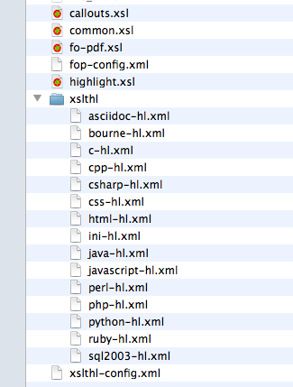

= asciidoctor-fopub
Dan Allen <https://github.com/mojavelinux>
v0.2.0, 2013-11-27
:license: https://github.com/asciidoctor/asciidoctor-fopub/blob/master/LICENSE[MIT]
:idprefix:
:idseparator: -
:experimental:

DocBook-to-PDF conversion using free software made easy! (based on DocBook XSL and Apache FOP)

Using the asciidoctor-fopub project, you can convert any DocBook file into a nicely formatted PDF with nothing more than a Java runtime (JVM) and development kit (JDK).
All the open source software required to perform the conversion is automatically fetched from the internet the first time you run it.

== Doing is believing

Before we get into the goals and the technical details of the project, let's see the conversion in action!

=== Prerequisites

The only prerequisite to perform the DocBook to PDF conversion is a Java Development Kit (JDK), which includes the Java runtime (and, naturally, an internet connection).
You can use any recent JDK (i.e., Java SE 6 or better).

If Java runtime (JVM) is setup correctly, you should be able to type:

 $ java -version

or

 $ "$JAVA_HOME/bin/java -version"

and see output that looks like:

....
java version "1.7.0_25"
OpenJDK Runtime Environment (fedora-2.3.10.3.fc17-x86_64)
OpenJDK 64-Bit Server VM (build 23.7-b01, mixed mode)
....

If the Java Devlopment Kit (JDK) is setup correctly, you should be able to type:

 $ javac -version

or

 $ "$JAVA_HOME"/bin/javac -version"

and see output that looks like:

....
javac 1.7.0_25
....

If not, you can install a JDK using your system's package manager or by downloading a distribution from the http://www.oracle.com/technetwork/java/javase/downloads/index.html[Java for developers download site].

WARNING: You may encounter problems if you attempt to use the GNU compiler for Java (gcj).
We recommend using OpenJDK or Oracle Java.

TIP: It's not even necessary to install the JDK on your system.
Simply set the +JAVA_HOME+ environment variable to the location where you extract the distribution.

Next, you need to retrieve the asciidoctor-fopub project.

=== Retrieve the project

You can retrieve the asciidoctor-fopub project in one of two ways:

. Clone the git repository
. Download a zip archive of the repository

==== Option 1: Fetch using git clone

If you want to clone the git repository, simply copy the URL of the repository on GitHub and pass it to +git clone+ command:

 $ git clone https://github.com/asciidoctor/asciidoctor-fopub

Next, change to the project directory:

 $ cd asciidoctor-fopub

==== Option 2: Download the archive

If you want to download a zip archive, click on the btn:[Download Zip] button on the right-hand side of the repository page on GitHub.
Once the download finishes, extract the archive, open a console and change to that directory.

TIP: Instead of working out of the asciidoctor-fopub directory, you can simply add the directory to your +PATH+ environment variable.

Next, let's grab a file to convert.

=== Generate a DocBook file

If you don't already have a DocBook file, you can generate one using http://asciidoctor.org[Asciidoctor] (or your tool of choice).

To create a DocBook file using Asciidoctor, first create an AsciiDoc file named [file]_sample.adoc_ in the current directory and populate it the sample content below.

.sample.adoc
[source,asciidoc]
----
= Document Title
Doc Writer <doc@example.com>

A sample http://asciidoc.org[AsciiDoc] document.

== Introduction

A paragraph followed by a simple list.

* item 1
* item 2

Here's how you say ``Hello, World!'' in Ruby.

.A basic Ruby application
[source,ruby]
puts "Hello, World!"

TIP: asciidoctor-fopub takes the pain out of converting a DocBook file to a PDF file like this one.
All you need is a Java Development Kit (JDK) and this project.
The rest of the software is fetched and configured by Gradle.
----

Convert the AsciiDoc file to DocBook using the +asciidoctor+ (or +asciidoc+) command:

 $ asciidoctor -b docbook -d book sample.adoc

You should now see a file named [file]_sample.xml_ in the current directory.

It's time to convert it to PDF!

TIP: You could also try these steps using the [file]_README.adoc_ file in the root directory of the project.

=== Convert DocBook to PDF

We're now ready to do the conversion!
It's as simple as running the +fopub+ script in the current directory on our DocBook file.

On Unix-based systems (e.g., Linux, OSX), run:

 $ ./fopub sample.xml

IMPORTANT: Since we're executing a local script, you need to prefix the name of the command with +./+.

TIP: If you've added the path to asciidoctor-fopub to your +PATH+ environment variable, you can leave off the +./+ and execute it from any directory.

On Windows, run:

 $ fopub sample.xml

NOTE: The first time you run the command, asciidoctor-fopub has to retrieve the software from the repositories and setup the conversion application, so be patient.

When it's all said and done, you should now see the file [file]+sample.pdf+ in the current directory.
Open that file with a PDF viewer to see the result.

.Sample PDF document rendered in viewer
image::sample-pdf-screenshot.png[Screenshot of sample PDF document]

As you can see, all the details of the conversion are hidden behind the scenes.
You get to focus on getting the job done, not worry about the mess that has to be sorted out to use Apache FOP correctly and get a decent-looking document.

=== Custom XSL parameters

Any arguments that follow the source file name are passed directly to the Apache FO processor (fop).
This feature allows you to assign XSL parameters, among other things.

Let's say you want to set the orientation of the PDF to landscape.
The DocBook XSL templates recognize the parameter named +page.orientation+.
Here's how you would pass that through fopub to fop.

 $ ./fopub sample.xml -param page.orientation landscape

You'll now notice that the PDF generated is rendered in landscape mode.

NOTE: See http://docbook.sourceforge.net/release/xsl/1.78.1/doc/param.html[DocBook XSL parameter reference] for a list of all XSL parameters you can set.

CAUTION: Custom parameters are currently only implemented in the Unix version of the fopub script.

=== Custom XSL templates

When you work on many documentations projets in *parallel*, you will probably need different outputs.

.Use cases for different templates

structure::

  . One needs a picture in the book title page
  . The other needs a special text at the bottom of this page

style::

  . One needs the default Asciidoctor style
  . The other uses the Colony style

In order to work on different documentation projects _in parallel_, you need to have different docbook-xsl directories.

How it works:

. Copy the +docbook-xsl+ directory from the fopub install directory to your documentation path, [file]_/path/to/custom/fopub_.
+
.Content of the docbook-xsl directory

. Update the files you want in this directory
+
For example if you want to use Colony style::
  You delete Asciidoctor theme, Foundation theme and you uncomment Colony theme in the +common.xsl+ file.

. Then you specify this directory when you launch the output generation :

 $ /path/to/fopub/fopub -t /path/to/custom/fopub/docbook-xsl sample.xml
 
=== fopub option flags

-t <path>::
  tells fopub which docbook-xsl directory to use (optional, defaults to location inside fopub installation)
-f [pdf|ps|fo]::
  tells fopub which output to produce (optional, defaults to +pdf+)
-h::
  prints usage

== Motivation

The asciidoctor-fopub project aims to provide a simple mechanism for converting DocBook to PDF.
The plan is to use some form of this project to handle the DocBook to PDF conversion in http://asciidoctor.org[Asciidoctor].
We hope it's generally useful outside of Asciidoctor as well.

If you've ever had to do this conversion, you will appreciate how overly-complex it is.
It requires fetching the right combination of software (including the right versions), putting all the files in the right location and associating them together using a catalog and passing in the correct parameters.
_It's boring and tedious._
This project handles all that magic so you don't have to.

In addition to making the conversion work, the project includes the following features that are often left out:

* Works with DocBook generated by AsciiDoc (supports all AsciiDoc processing instructions)
* Syntax highlights source code listings using http://sourceforge.net/projects/xslthl[XSLTHL] (including a highlighter for AsciiDoc source)
* Scales down images to fit within the width of the page
* Applies (configurable) formatting and styling that's consistent with the Asciidoctor themes
* Loads and embeds system fonts necessary to support the themes (Arial, Georgia and Liberation Mono)
* Applies configuration to embed SVG-based admonition icons and callout marks
* Works without an internet connection (once the initial run is complete); _drastically speeds up execution_
* Works from any directory (planned)

There's a lot of research that went into making all that happen for you :)

NOTE: One of the most important features of this tool--and one of the most difficult to get right--is that it works offline.
By default, XSL processors fetch all necessary resources from the internet.
Since these files are large and reference many other files, fetching them from the internet is exceptionally slow and a waste of network bandwidth.
The +fopub+ tool carefully ensures that the processor has all the files it needs (on the first run) and thus keeps it from reaching out to the internet while it performs the conversion.

== Technical details

Let's talk tech.

=== The conversion's key players: Apache FOP and DocBook XSL

The main goal of this project is to download, configure and execute http://xmlgraphics.apache.org/fop[Apache FOP] to handle the conversion from DocBook to PDF using the http://en.wikipedia.org/wiki/DocBook_XSL[DocBook XSL] stylesheets.
You can see from the first part of the http://www.sagehill.net/docbookxsl[DocBook XSL book] what a complex proposition this is.

DocBook XSL:: The purpose of DocBook XSL is to provide a standard set of XML transformations (XSLT) from DocBook to several presentational formats, one of which is XSL-FO.

Apache FOP:: Apache FOP (Formatting Objects Processor) is a print formatter driven by XSL formatting objects (XSL-FO) and an output independent formatter.
It is a Java application that reads a formatting object (FO) tree and renders the resulting pages to a specified output.
The primary output target is PDF.

Apache FOP also includes an XSLT processor (Xalan) that handles the conversion from DocBook into the intermediatory XSL-FO format that the print formatter uses to create the PDF.

When the software is all setup, we are ultimately running a command in the +fopub+ script similar to this one:

 $ fop -xml sample.xml -xsl docbook-xsl/fo-pdf.xsl -pdf sample.pdf

In reality, it's more complex.
You can see the full command at the bottom of the +fopub+ script.

=== Source highlighting using XSLTHL

Readers have come to expect source code to be highlighted so it looks the same way in the document as it does in their source code editors.
http://sourceforge.net/projects/xslthl[XSLTHL] provides source highlighting for PDF output.

XSLTHL integration is a well-hidden feature in the DocBook XSL project.
It requires a Java-based XSLT processor (like the one embedded in Apache FOP) to use it.
Activating it requires passing special parameters to the processor that specify the location of the configuration file and a flag to turn it on.

When everything falls into place, as it does with the +fopub+ script, you get nice syntax highlighting in your PDF file and happy readers.

=== Priming the pump with Gradle

Setting up a Java application is no small feat.
So what fetches the software and puts it all in the right place?
That handywork is performed by Gradle.

http://www.gradle.org[Gradle] is a Java-based automation and build tool that specializes in setting up Java applications (among other capabilities).
Gradle can fetch files from remote repositories, move them around, create start scripts and assemble an application distribution.

We are using Gradle to prepare a Java application into the +build/fopub+ directory that the +fopub+ script can execute.

You may be wondering why Gradle isn't a prerequisite of this project.
The answer is that the Gradle project provides a tool that can bootstrap Gradle from nothing.
That tool, +gradlew+, is included with the project.
It gets invoked the first time you run the +fopub+ script.
*Magic.*

And that's essentially what this project is all about, *magic*.
Converting from DocBook to PDF shouldn't be hard.
We are doing our best to hide those details so that it's as simple as it should be.

== Software versions

[cols="2*", options="header"]
|===
|Software Project |Version

|Apache FOP
|1.1

|DocBook XSL
|1.78.1

|Apache Commons XML Resolver
|1.2

|Xalan
|2.6.0

|XSLTHL
|2.1.0

|Gradle
|1.7
|===

== Contributing

In the spirit of free software, _everyone_ is encouraged to help improve this project.

To contribute code, simply fork the project on GitHub, hack away and send a pull request with your proposed changes.

Feel free to use the https://github.com/asciidoctor/asciidoctor-fopub/issues[issue tracker] or http://discuss.asciidoctor.org[Asciidoctor mailing list] to provide feedback or suggestions in other ways.

== Authors

*asciidoctor-fopub* was written by https://github.com/mojavelinux[Dan Allen].
It builds on prior work done by authors of the http://asciidoc.org[AsciiDoc], https://github.com/pressgang/jdocbook-core[jDocBook] and http://www.jboss.org/pressgang[PressGang] projects.

== Copyright

Copyright (C) 2013 Dan Allen.
Free use of this software is granted under the terms of the MIT License.

See the link:LICENSE[LICENSE] file for details.
